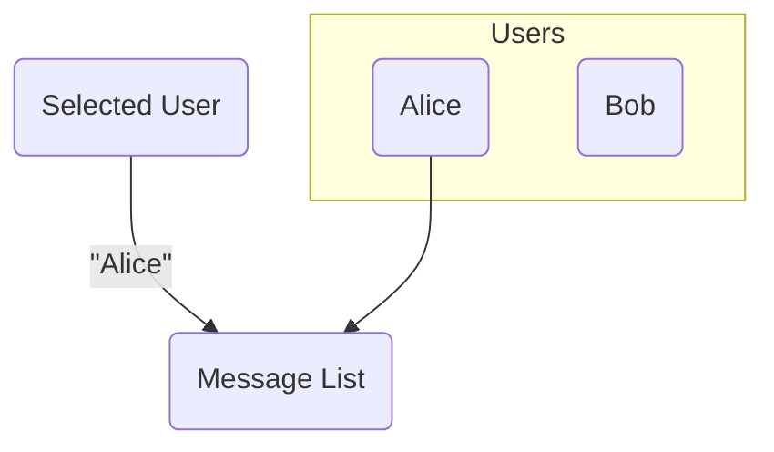
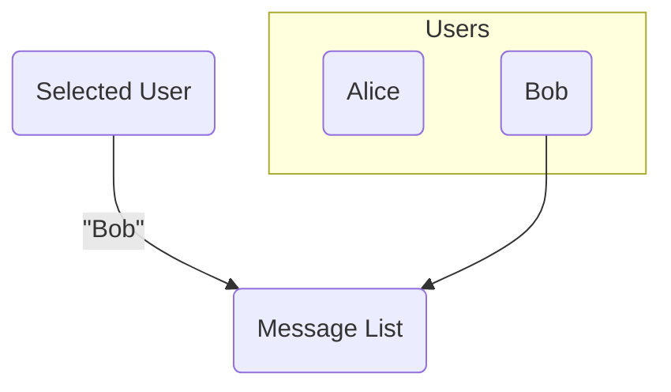
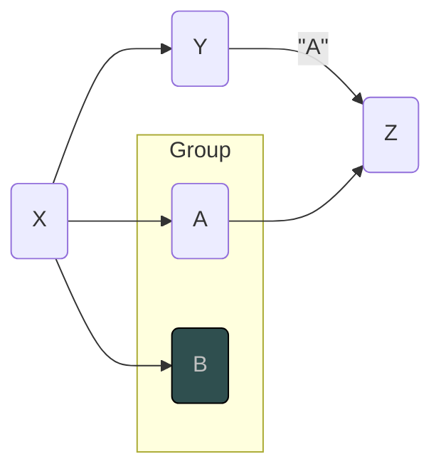
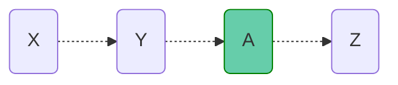
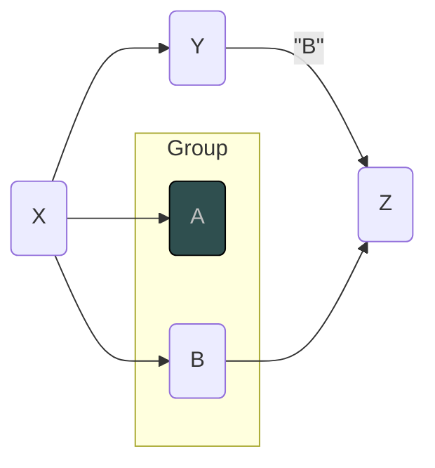
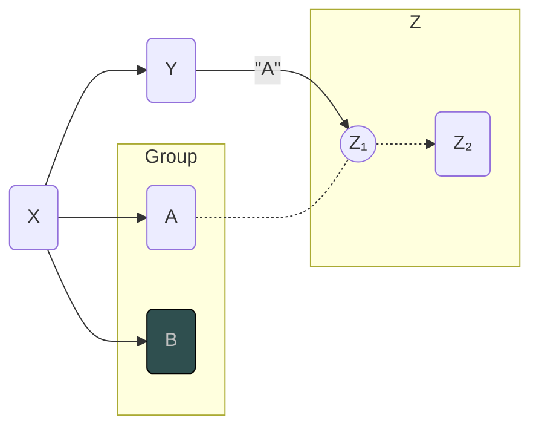
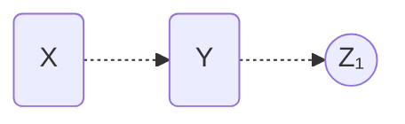
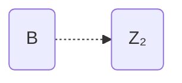

# 3 - Dynamic Dependencies

## 3.1 - Value-Dependent Dependency

Sometimes the dependencies of a node change based on the value of another node. For example, consider a chat app, where the list of messages displayed depends on which user is selected.

This charts ilustrates it:

If the selection changes:

In this scenario, the dependency graph changes mid-execution.

## 3.2 - Trap: Execution of a Node that will be Unsubscribed

For this example, let's assume nodes are Lazy, where they are only calculated when they have a subscriber. Inactive nodes will be colored dark.

Consider the following graph:

Now, let's trigger a change in `X`, which will cause the value of `Y` to change to `"B"`. Using topological sorting at the beginning of the change, this is one of the orders we could get:

And it would result in the following final dependency graph:

Notice that the execution order contains `A` and doesn't contain `B`, but looking at the final dependency graph, ideally `A` shouldn't be executed, and `B` needs to be executed.

And notice that `Z` will only define its dependencies once it's executed, but in the topological order, it should only be executed after `A`

## 3.3 - Layered Topological Sorting

What we can do to prevent the trap mentioned above is to set a dependency on the dependency. Basically saying that `A -> Z` depends on `Y -> Z` first. It's a bit harder to represent in drawing, but let's expand `Z` to visualize it better:

Now we have the `Z₁` sub-node that is responsible to choose which node within `Group` will be used.

So now we can define the expected execution order in layers:

**Layer 1:**

And once we finish this layer, `Z₁` will update it's dependency from `A` to `B`, and we can execute the second layer:

**Layer 2:**

##### Pseudo-Algorithm:

-   Sort the nodes topologically, ensuring all leafs are at the end of the list
-   Start on the leaf nodes, and set their layer to 0
-   Walk back the sorted list, for each node:
    -   For direct dependencies (`X -> Y`) or value-dependent dependencies (`Z -> A`), set the dependency's layer to the same as the dependent's, if it's larger than the current layer of the dependency
    -   For dependency-defining dependencies (`Y -> Z`), set the dependency's layer to the dependent's layer + 1, if it's larger than the current layer of the dependency
-   Start the execution from the largest layer

##### Problem:

-   This algorithm could end up sorting a bunch of nodes in layers that might be updated depending on higher layers. Ideally should only calculate the first layer.
