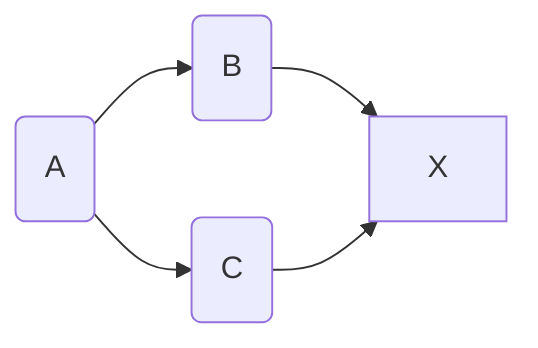
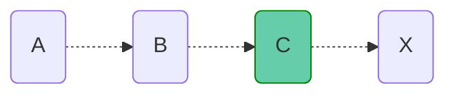
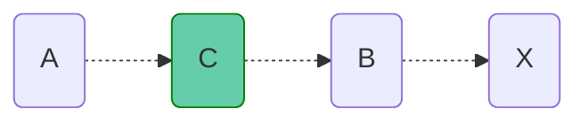
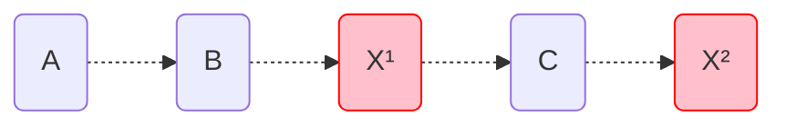
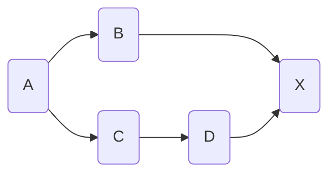
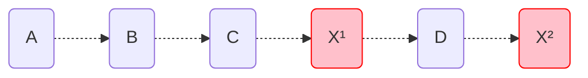

# 2 - Propagation of changes

## 2.1 - Trap: Immediate Execution

With Immediate Execution, each Node notifies their dependents, which are executed immediatelly. Similar to a [Depth-First Graph Search](https://en.wikipedia.org/wiki/Depth-first_search).

Consider the following graph:

##### Expected Execution Order:

or

Note that the order between `B` and `C` doesn't matter, because there's no dependency between them

##### Actual Order with Immediate Execution:

Notice that `X` would be executed twice, and in the first execution, `X¹` would have an outdated value for `C`, since it hasn't been calculated yet. This could result in glitches where an invalid intermediate value is emitted.

## 2.2 - Trap: Execution Queue

With an execution queue, each node enqueues their dependencies to be executed in order. Similar to [Breadth-First Graph Search](https://en.wikipedia.org/wiki/Breadth-first_search). This approach would yield the correct order for the previous graph.

Take this graph into consideration:

A Breadth-First execution order could look like this:

## 2.3 - Topological Execution Order

If the dependency graph is static during execution, the nodes can be sorted using a [Topological Order](https://en.wikipedia.org/wiki/Topological_sorting), which takes the graph dependencies into consideration when creating the order of execution, preventing the traps mentioned above
